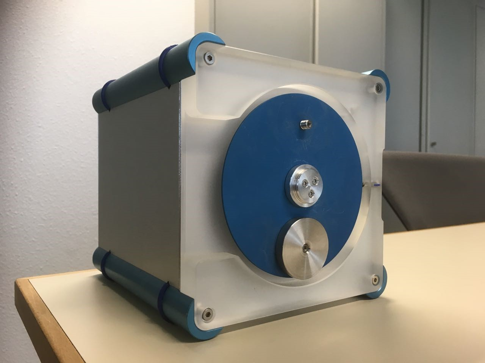

# gym-unbalanced-disk

This is the gym python environment for the unbalanced disk as seen below



This repository includes 
1. benchmark datasets used for identification tasks.
2. **simulators** (both python and matlab)
3. Instruction and scripts to connect to the **experimental setup**

Note that the simulator is accurate model of the experimental setup for the provided model parameters. 

# 1. benchmark datasets used for identification tasks.

**Update 15 May: an updated hidden test dataset for the simulation has been released, and the simulation benchmarks have been updated**

In `disc-benchmark-files/` you can find the following:

## 1.1. Training and test data:

* `training-val-test-data.[csv,mat,npz]` which contains the data for your system identification task – you can partition this data into training, validation and test in the way that you see fit.
* `hidden-test-prediction-submission-file.[csv,mat,npz]` contains the (past) input and output data required to perform a 1 step-ahead prediction. This also illustrates the file format that we expect for the prediction task submission (by replacing the zero entries of the y[k-0] output with your estimate).
* `hidden-test-simulation-submission-file.[csv,mat,npz]` contains the input sequence and the first 50 output values of the system. The latter output samples are replaced by zeros. This data should be used to simulate the remainder of the outputs of the system. This also illustrates the file format that we expect for the simulation task submission (by replacing the zero entries of the output with your estimate).

## 1.2. Example usage of training and test data:

* `example-prediction-solution.py` an example file which shows a simple linear ARX prediction solution using the datasets provided.
* `example-simulation-solution.py` an example file which shows a simple linear ARX simulation solution using the datasets provided.

## 1.3. Submission Validation checker:

* `submission-file-checker.py` is run as `python submission-file-checker.py submitted-file solution-file` to compute the prediction/simulation errors. You can also run this file to check if your file has the appropriate format by running `python submission-file-checker.py submitted-file test-prediction-submission.npz` which successfully ends without an error if the submitted-file has the correct format
 
## 1.4. Benchmark results

You can use the following baseline results to position the quality of your model estimates. Please include the baseline values when reporting about your model quality.

**Simulation Results:**

| Type          | RMSE (radians) | RMSE (deg) | 
| ------------- | -------------- | ---------- | 
| Lower bound   | 0.0195         | 1.12       |
| Good NN model | 0.0271         | 1.55       | 
| Linear Model  | 0.255          | 14.6       | 

**Prediction Results:**

| Type          | RMSE (radians) | RMSE (deg) | 
| ------------- | -------------- | ---------- | 
| Good NN model | 0.00382        | 0.219      | 
| Linear Model  | 0.00665        | 0.381      | 

## 2.1 Simulator python

### Installation

Use any terminal or equivalent and enter

```
python -m pip install git+https://github.com/GerbenBeintema/gym-unbalanced-disk@master
```

or download the repository and install using

```
git clone https://github.com/GerbenBeintema/gym-unbalanced-disk.git #(or use manual download on the github page)
cd gym-unbalanced-disk
pip install
```

By using git clone you are able to change aspects of the observation space or action space easily.

### Use python simulator

```python
import gymnasium as gym
import gym_unbalanced_disk, time

env = gym.make('unbalanced-disk-v0', dt=0.025, umax=3.) 
#env = gym_unbalanced_disk.UnbalancedDisk(dt=0.025, umax=3.) #alternative

obs, info = env.reset()
try:
    for i in range(200):
        obs, reward, terminated, truncated, info = env.step(env.action_space.sample()) #random action
        print(obs, reward)
        env.render()
        time.sleep(1/24)
        if terminated or truncated:
            obs = env.reset()
finally: #this will always run
    env.close()
```

Lastly, we also provide: 'unbalanced-disk-sincos-v0' or `gym_unbalanced_disk.UnbalancedDisk_sincos` which is the same environment but where angle is now expressed in sine and cosine components.

## 2.2 MATLAB Simulator

Download the `matlab-simulator` files and either use the function or the Simulink files. 

Note that The simulink model requires the Simulink 3D Animation toolbox to visualize the unbalanced disk setup (https://nl.mathworks.com/products/3d-animation.html). Note that the simulation files and figures should be added to the matlab path. It could be that the animation does not load well on first startup. Close the animation and open it again in case this happens.

# 3. Connecting to the experimental setup

## 3.1 Python connection

To use the experimental setup with the python environment you will need to follow steps.

1. Installation python simulator as shown before
2. Install the USB drivers using the instructions in `WindowsDcscUSB/README.txt`. 
3. Download the form [libusb](https://sourceforge.net/projects/libusb-win32/files/libusb-win32-releases/1.2.6.0/) (file: `libusb-win32-devel-filter-1.2.6.0.exe`). Install, run the program and apply a filter to "DCSC FPGA application" (`vid:04b4 pid:8612`).
4. Test connection by opening and running `examples-connect-to-exp/python-disk-test.ipynb`

Now use the following to create an environment with a connection to the system

```python
env = gym.make('unbalanced-disk-exp-v0', dt=0.025, umax=3.) #both are equivilent (this one has a time limit build in)
env = gym_unbalanced_disk.UnbalancedDisk(dt=0.025, umax=3.) #both are equivilent
```

## 3.2 Matlab connection

To use the experimental setup you will need to do the following things.

1. download `examples-connect-to-exp`
2. Install the USB drivers using the instructions in `WindowsDcscUSB/README.txt`. 
3. test connection by running `examples-connect-to-exp/matlab_disk_test.m`
